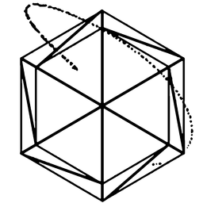
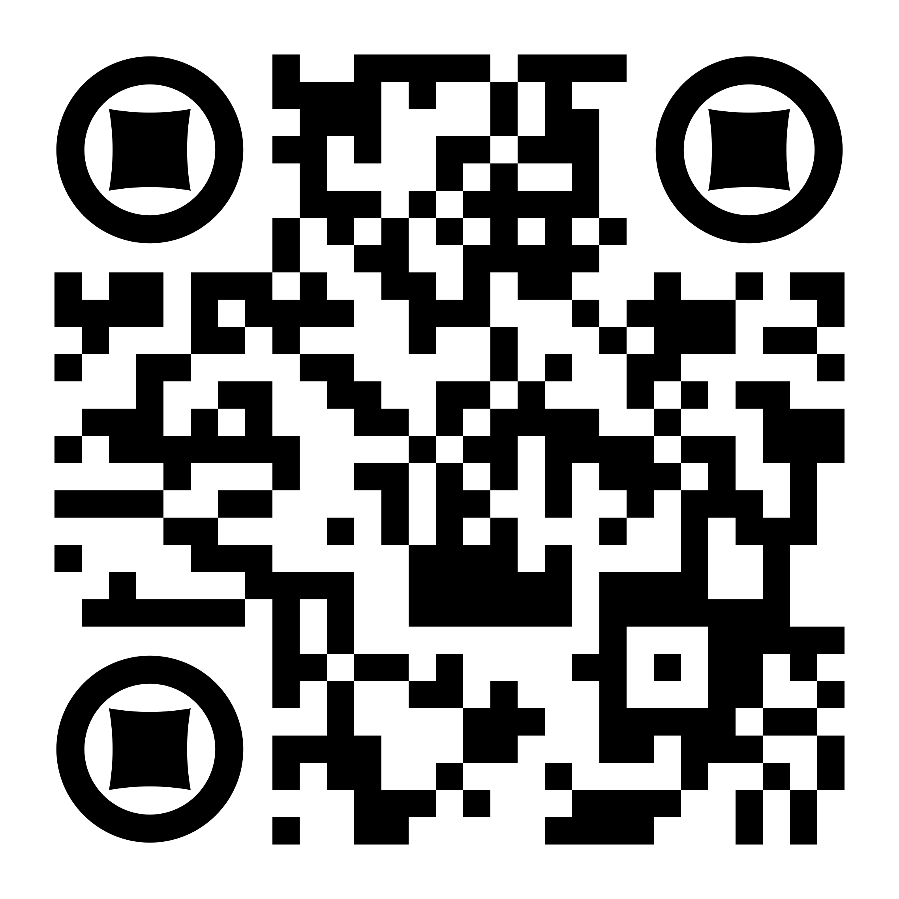

# starmap: Immersive three dimensional visualisation of single cell data using smartphone-enabled virtual reality

Authors: Andrian Yang, Yu Yao, Jianfu Li and Joshua W. K. Ho

Contact: j.ho@victorchang.edu.au

Copyright © 2018, Victor Chang Cardiac Research Institute

## Synopsis

starmap is a web-based VR-enabled tool which combines a 3D scatter plot with star plots (radar chart) to visualise hundreds of thousands of multivariate data points, such as single-cell expression data. starmap can be accessed from a desktop, laptop or a mobile device from the following link: [https://vccri.github.io/starmap/](https://vccri.github.io/starmap/), or the QR code. 
## Input data

starmap accepts as input a csv file or a zip-compressed csv file. The csv file need to contain a header row with the following column names - x, y, z and cluster - corresponding to the 3D coordinates of points and the cluster label assigned for each point (with outliers assigned the value of -1). In addition to the required columns, starmap also accepts extra columns (up to 12) corresponding to features which will be visualised in the star plot. The values for all columns must be of numeric types.

To see an example of input data, please see the sampleData folder which contains two example datasets based on previously published single-cell RNA-seq data and flow cytometry data.

## Usage instructions

starmap supports a number of input methods for interacting with the visualisation - keyboard, remote control and voice control. Note that voice control is available only in Google Chrome (desktop and mobile) as voice control utilises the SpeechRecognition API which is currently only supported by Chrome.

A summary of the control scheme for keyboard and voice control is included in the table below.

| Command | keyboard control | voice command |
| ------- | ---------------- | ------------- |
| forward | w | forward |
| backward | s | backward |
| left | a | left |
| right | d | right |
| zoom in | q | in |
| zoom out | e | out | 
| rotate Y-axis clockwise | left arrow | N\A |
| rotate Y-axis anti-clockwise | right arrow | rotate |
| rotate X-axis clockwise | up arrow | N\A |
| rotate X-axis anti-clockwise | down arrow | N\A |
| click on toolbox (VR mode) | N\A | select |
| reset toolbox (VR mode) | N\A | reset |
| reset view (VR mode) | N\A | init |

The control scheme for remote control is shown below.

